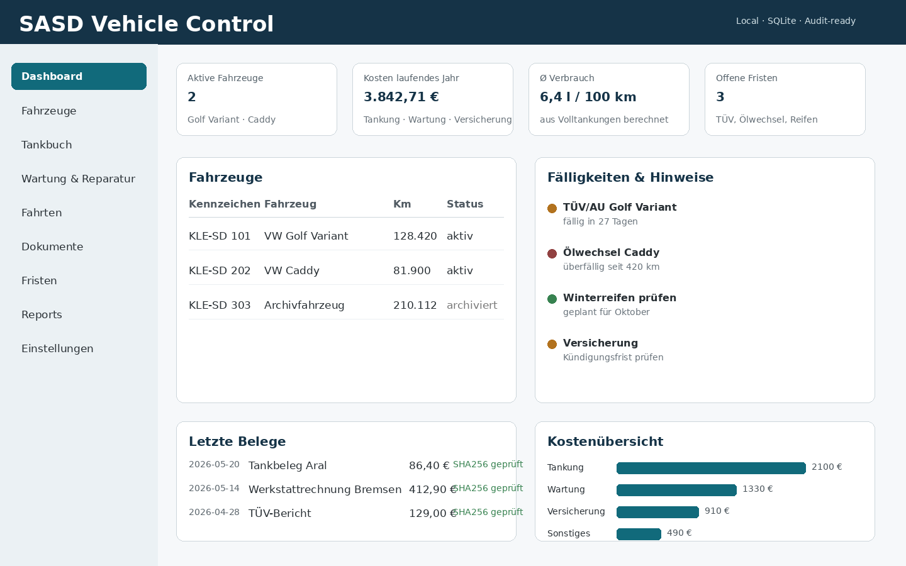

# SASD Vehicle Control

**SASD Vehicle Control** ist ein geplantes Schwesterprojekt zu **SASD Finance Control**. Ziel ist eine lokale, vertrauenswürdige und dokumentenorientierte KFZ-Verwaltung für kleine Unternehmen, Selbständige und private Fahrzeugverwaltung mit professionellem Anspruch.



## Zielbild

Die Anwendung soll Fahrzeuge, Tankbelege, Wartungen, Reparaturen, Fristen, Dokumente und einfache Kostenberichte strukturiert verwalten. Der Schwerpunkt liegt nicht auf GPS-Live-Tracking, sondern auf nachvollziehbarer Dokumentation, Kostenkontrolle und späterer Integration in die SASD-Finanzverwaltung.

## Geplante Kernfunktionen V1

- Fahrzeugverwaltung mit Archivierung statt stiller Löschung
- Tankbuch mit Liter, Preis, Kilometerstand, Tankstelle und Beleg
- Wartungs- und Reparaturdokumentation
- Dokumentenarchiv mit SHA256-Hash und Originaldateinachweis
- Fristen und Erinnerungen für TÜV, Inspektion, Ölwechsel, Reifen und Versicherung
- einfache Kostenberichte pro Fahrzeug, Monat, Jahr und Kategorie
- lokale SQLite-Datenbank
- Export als CSV/Markdown/JSON
- ZIP-Backup mit Manifest
- Audit-Grundlagen für spätere Revisionsnähe

## Abgrenzung

Nicht Ziel der ersten Version sind GPS-Live-Tracking, OBD-II-Diagnose, automatische Fahrterkennung, Routenoptimierung, komplexe Fahrer-Apps oder vollständige ERP-Funktionen.

## Architekturidee

```text
Sasd.VehicleControl.sln
├── src/
│   ├── Sasd.VehicleControl.App
│   ├── Sasd.VehicleControl.Domain
│   ├── Sasd.VehicleControl.Application
│   └── Sasd.VehicleControl.Infrastructure
├── tests/
│   └── Sasd.VehicleControl.Domain.Tests
├── docs/
└── assets/screenshots/
```

## Beziehung zu SASD Finance Control

SASD Vehicle Control soll eigenständig entwickelt werden, aber fachlich und technisch anschlussfähig an SASD Finance Control bleiben. Spätere Integrationen können Belege, Lieferanten, Verträge, Zahlungen, Kostenstellen und Berichte verbinden.

## Status

Dieses Repository ist ein vorbereiteter Projektstart mit README, Dokumentationsstruktur und UI-Mockup. Es enthält noch keine produktive Anwendung.
